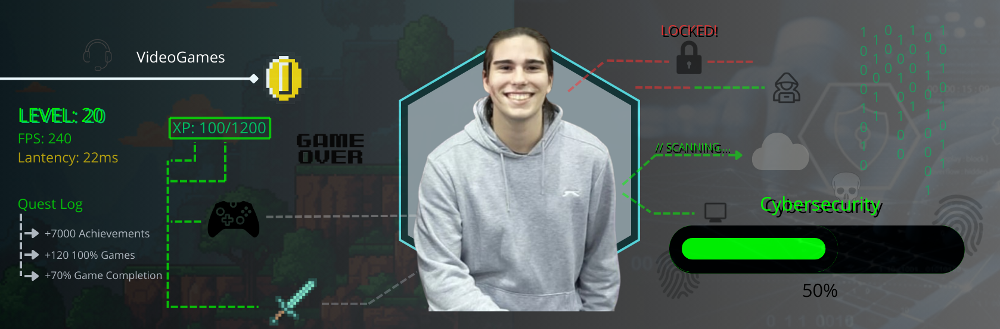

  

# Hi! I'm Daniel, I'm currently studying for Computer Engineering!

### 🚀 More about me
- 🎓 Student in **University of Coimbra**
- 💻 Right now, messing with compilers, C++ and CentOS
- 🎯 Focused on increasing in different areas about Programming Languages and Projects

### 🛠️ Languages I've worked in university projects
**Core & Systems:**

**Application & Web:**

**Database:**

### Feel free to contact me in any social media!